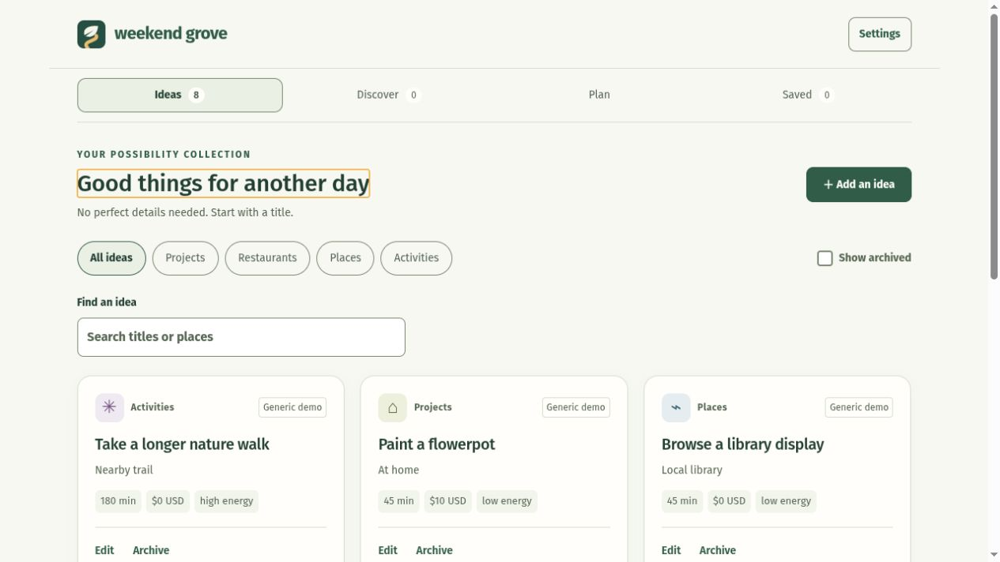

# Weekend Grove

A self-hosted idea bank and weekend planner for making a little room for good things.

Collect projects, restaurants, places and activities. Pick your limits, generate a Saturday/Sunday plan, lock your favorites and save a weekend to revisit. Optional discovery brings nearby possibilities into a review inbox; optional weather adds context to each day.

**[Installation guide](docs/guide/Home.md) · [GitHub Wiki](https://github.com/BrandedTamarasu-glitch/WeekendGrove/wiki) · [Unraid setup](docs/guide/Unraid-installation.md) · [Bring your own API key](docs/guide/API-keys-and-discovery.md)**

## What you can do

- **Ideas:** add a title and category, fill in details later, search/filter, edit and archive.
- **Discover:** review incoming suggestions, save or dismiss them, and optionally schedule weekly refreshes for your ZIP and travel range.
- **Plan:** set a shared weekend time/budget, energy ceiling, daily category caps and optional Lazy Day blocks. Lock and reroll suggestions.
- **Saved:** keep dated snapshots that survive edits and restarts.
- **Settings:** manage weather, discovery, estimates, currency, light/dark appearance and backups.

Python's standard library, SQLite and plain HTML/CSS/JavaScript power the app. There are no external browser assets, telemetry or Python package dependencies. Manual planning works offline; optional lookups contact the disclosed providers.



*Screenshots use only the built-in generic samples, never a household database.*

## Start on your computer

Install Git and Docker with Compose, then:

```sh
git clone https://github.com/BrandedTamarasu-glitch/WeekendGrove.git
cd WeekendGrove
docker compose up --build -d
```

Open **[http://127.0.0.1:8765](http://127.0.0.1:8765)** once `docker compose ps` shows healthy. A new installation starts empty; sample ideas are optional in Settings. Docker builds from source—there is no published registry image to pull. Data lives in a persistent named volume. Never use `down --volumes` unless you intentionally want to delete it.

Prefer Python? Run `python3 server.py` with Python 3.11+ and system timezone/CA data. Its default database is `data/weekend.sqlite3`. See the [step-by-step quick start](docs/guide/Quick-start.md) for requirements, stopping, persistence and LAN access.

## Install on Unraid

Follow the [native Docker-template guide](docs/guide/Unraid-installation.md) to choose healthy storage, build/load a pinned image, prepare UID/GID 10001 permissions and bind the chosen private interface. Compose is also documented as an alternative. No Community Applications listing is assumed.

**There is no login. Anyone who can reach the app can read and change its data.** Defaults are localhost-only. Trusted home-LAN hosting is optional; internet hosting is not ready. Do not port-forward or publish a tunnel. Host validation is not authentication.

## APIs are optional, and keys are yours

- Core Ideas/Plan/Saved and backups need no key.
- Geoapify adds restaurants and selected places using **your own account and private server-side key file**. No maintainer key is included or shared. [Setup instructions](docs/guide/API-keys-and-discovery.md) explain masked entry, permissions and `_FILE` variables.
- The City of Stanwood calendar is key-free but regional, not a nationwide search.
- Ticketmaster is optional, with offline-tested filters and unresolved operational/retention responsibilities; read the limitations before enabling it.
- Weather uses Open-Meteo without a key. It requires page-session consent and an explicit click, supports up to 16 days including today, and is never stored with saved plans. [Weather guide](docs/guide/Weather.md).

A fresh install starts with lookups and weekly refresh off. Review provider terms, quotas and outgoing-data disclosures before opting in. No paid account is created by this project.

## Honest limits

Suggestions are not reservations or guarantees of suitability. Check original listings, opening hours, prices and accessibility. Distances are approximate straight lines; routes and clock-time conflicts are not calculated. Missing cost/time/energy use labeled estimates. Currency changes relabel amounts without conversion. There is no plan deletion, automatic backup schedule, authentication or multi-user separation yet.

## Keep your data safe

Use **Settings → Export JSON** and **Database backup**, with a copy on another device. JSON restore adds missing records rather than replacing edits; full database recovery is a separate deliberate operation. Keys are excluded from these app backups. Read [backups, upgrades and rollback](docs/guide/Backups-and-upgrades.md) before changing an existing installation.

## Documentation and verification

The [versioned guide](docs/guide/Home.md) is maintained alongside source and mirrored to the [Wiki](https://github.com/BrandedTamarasu-glitch/WeekendGrove/wiki). Start with [everyday use](docs/guide/Settings-and-everyday-use.md) or [troubleshooting](docs/guide/Troubleshooting.md).

Local checks (no GitHub Actions required):

```sh
python3 -W error::ResourceWarning -m unittest discover -s tests
node tests/weather_view_test.cjs
node tests/theme_test.cjs
node tests/readability_test.cjs
```

The current app passed 80 Python tests and these three JavaScript suites. A pinned image has also been built and checked on Unraid for health/restart/data preservation. Desktop and 320/390px browser layouts were checked; physical-phone coverage and universal platform support are not claimed. See [verification](docs/verification.md) and [roadmap](ROADMAP.md).

## License

[MIT](LICENSE). Provider data and APIs retain their own attribution and terms.
