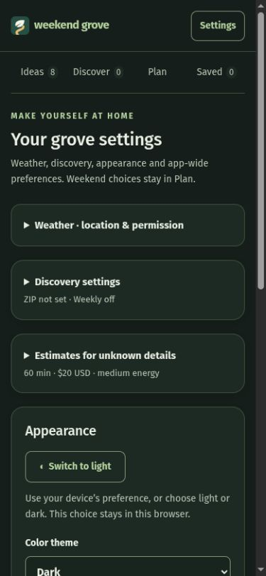

# Settings and everyday use

[Guide home](Home.md) · [API setup](API-keys-and-discovery.md) · [Weather](Weather.md)

## Your first weekend

1. In **Ideas**, choose **Add an idea**. A title and category are enough. Optional duration, cost, location and energy make planning more useful. Set Indoor, Outdoor, Mixed or Unknown yourself; the app does not infer it from a name or category. Search by title/location or filter by category; archive things you no longer want suggested.
2. In **Plan**, select a Saturday, your total weekend time and budget. Open **More planning options** for energy, number of ideas, daily category caps and optional Lazy Day blocks.
3. Choose **Find my weekend**. Saturday and Sunday share the total time and budget. Lock anything to keep, then reroll the rest. Fewer ideas can be a valid result; the planner does not fill every slot or optimize the fullest plan.
4. Name it and **Save plan**. **Saved** holds snapshots, so later edits to ideas do not rewrite an earlier weekend. Unsaved previews are temporary. Plan deletion is not implemented.

Lazy Day adds a 30- or 60-minute relaxation block when it fits, at most one per day. It uses time but no money, idea-count slot or category quota. Daily caps are maximums, not targets. A locked suggestion must still fit the selected limits.

Dates from event sources must match the selected Saturday/Sunday. The planner does not check opening hours, travel time or overlapping clock times. Include travel/preparation in your own duration estimates.

## App-wide settings

- **Weather:** ZIP, IANA timezone and manual permission. No key needed; see [Weather](Weather.md).
- **Discovery settings:** US ZIP, local radius and optional day-trip radius; source permissions and weekly schedule. See below.
- **Estimates for unknown details:** initially 60 minutes, $20 USD and medium energy. Unknown fields remain blank in Ideas; generated/saved plans label estimates. Saving new estimates does not rewrite an existing preview or snapshot.
- **Appearance:** device setting, light or dark. This preference stays in the current browser; other browsers choose independently.
- **Cost currency:** USD, CAD, EUR, GBP, AUD or NZD. Changing currency relabels existing amounts; it does not convert them. Existing snapshots keep their currency.
- **Backups & sample ideas:** JSON export/restore, consistent database download and optional generic demos. Editing a demo makes it your own.
- **Automatic database backups:** optional daily copies to an installer-selected, mounted folder. Choose your timezone/time and retention, approve scheduling and cleanup separately, and review last-success/failure status. Both are disabled by default; see [setup and recovery](../portable-itineraries-and-backups.md).

An explicit cost of zero means free; blank cost means unknown. Energy is a maximum per idea, not a cumulative weekend effort score.

## Configure Discover

1. Open **Settings → Discovery settings**. Enter your own five-digit US ZIP. `90210` is a generic documentation example, not a suggested personal location.
2. Set local miles (default 30). If wanted, enable day trips and set that radius (default 100). Each radius is 1–150 miles, with day-trip radius at least local radius. Distances are straight-line approximations from ZIP center, not driving distances.
3. Read the displayed outgoing-data disclosure. Grant global public-lookup permission only if you want those requests. Separately enable only the key-backed providers you have configured. Save settings.
4. In **Discover**, manually refresh. Review source links, checked dates and distance. **Save** adds a suggestion to Ideas; **Dismiss** keeps it out of the pending inbox. History retains your decisions.
5. Only after a successful manual refresh, optionally enable weekly refresh. Choose weekday, time and your IANA timezone, such as `America/Los_Angeles`, then save. A fresh install defaults to Thursday 08:00 with scheduling **off**; it does not inherit another user's schedule.

Manual refresh has a five-minute cooldown. The app must be running for scheduled work; a missed schedule catches up once after downtime. Failed providers are not repeatedly retried within a run. Empty results can mean limited source coverage, filtering, a provider problem or no matching result—not no nearby activities.

Changing ZIP affects future refreshes. Existing saved ideas and inbox history keep earlier distance estimates. Saving an idea does not create a live subscription to future venue changes. Verify the original source before going.

## Mobile appearance

This example uses generic samples, a blank ZIP and disabled weekly refresh.

## Optional weather-aware Plan B

In **Plan → Weather-aware Plan B**, opt in and choose a 40%, 60% (default) or 80% precipitation trigger. You can separately include forecast rain, snow or storm conditions. These preferences last only for the page session. Wind is not used.

Check weather manually as usual. For outdoor/mixed suggestions, a fresh matching ZIP/date/timezone forecast can show a reason to consider an indoor alternative. Choose **Find indoor alternative**, then explicitly **Swap to** an idea. Nothing changes automatically. Only ideas you labeled Indoor are offered, and each must fit the same day, time/budget, energy, daily category caps, duplicates and Lazy Day time. A locked target must be unlocked first. Changed planning limits require regeneration/reroll before a swap.

**Keep current idea** cancels; **Undo last swap** explicitly restores the previous idea if it is still available and fits. Unlock a replacement before undoing. Swaps affect only the unsaved preview; save it when ready. Existing historical plans remain unchanged. No feasible alternative is a normal result—add an indoor idea or keep the plan.

No extra provider lookup is made by Plan B. Outages, revoked permission, wrong ZIP/date/timezone and forecasts aged one hour or more block new advice. Unknown weather does not mean safe weather. ZIP-area forecasts may differ at a day-trip destination, and an Indoor label is not a guarantee of accessibility or suitability.

## Portable itinerary

Use **Download / print itinerary** from a generated plan or an expanded saved weekend. Optional notes affect only that copy. Downloaded HTML works offline without scripts/assets; browser printing supports paper or PDF. Map links make no request until you open them. Old snapshots retain unspecified dates rather than inventing them. See [portable itineraries and backups](../portable-itineraries-and-backups.md) for privacy and setup details.
