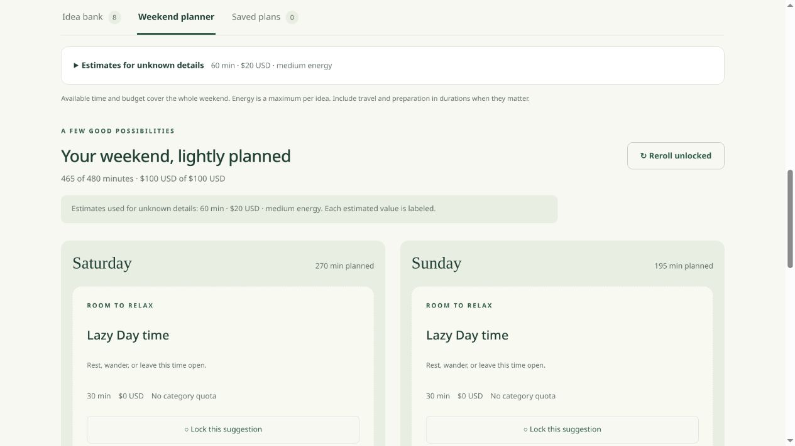

# Verification record

## Itineraries and backups — deployed October 7, 2026

The pinned merged image `05de81119c4fc56a06ee655aa1765bb4f37accfb` built on Unraid and passed an isolated container validation before production cutover. The focused inline suite covered consistent SQLite/WAL copies, private permissions, key-file exclusion, restore and repeated initialization, checksum-owned retention, preservation of manual/migration/modified copies, subprocess settings persistence, and fail-closed storage/corruption/interruption cases. The container used UID/GID 10001, a read-only root, dropped capabilities, no-new-privileges, and network mode none. This host exposes a dormant `tunl0`; the check required it to be down and unaddressed, verified no non-loopback IPv4/IPv6 routes, and checked unreachable external routes without sending datagrams. Both the fixture suite and subsequent real-backup restore check exited 0. These were focused deployment checks, not a rerun of the full unit suite inside the image.

The native production container became healthy after update and restart. Five deployed static files matched the pinned source byte-for-byte. Private before/after exports and discovery responses were identical. The existing LAN binding, runtime restrictions, native autostart, key-file reference and weekly discovery schedule were preserved. Daily backups were enabled at the owner's approved local time with seven-copy checksum-owned retention on a dedicated directory on another array disk. The first real copy passed SQLite integrity, UID/GID and mode checks; an isolated restore matched the preserved production export across two initializations, and the original backup bytes remained unchanged. Settings and first-success status survived a production restart. Generated fixture data and the validation container were removed; the empty fixture directory and inactive validation stack definition remain. Private rollback captures and evidence remain outside the repository. No provider refresh, key read, GitHub Actions run or unrelated container change was part of this deployment. A future scheduled run has not yet been observed, and a same-server backup does not protect against server-wide loss.

## Itineraries and backups — publication validation

105 offline Python tests and five JavaScript suites pass. New checks cover database-only copies, private permissions, corruption/unavailable storage, interrupted operations, overlap prevention, retention ownership/checksums, destination reapproval, DST/catch-up, and isolated restore with saved snapshots/discovery decisions/currency preserved across reinitialization. Itinerary safety checks cover escaped content, explicit map links, missing dates/locations, estimates, Lazy Day blocks and no scripts or external assets.

Isolated headless Chromium checked current/saved/legacy itineraries, download and PDF print content, cancelling and reopening notes, both palettes at desktop/390/320px, backup approval/pause, cancelled/repeated manual copies and simulated failure recovery. A downloaded file rendered with JavaScript disabled and made no external requests. This is local browser emulation, not a physical-phone test. The optional backup Compose overlay was configuration-checked, including missing-destination rejection; no container runtime or production deployment is claimed for this branch.

## Discovery and Plan B — released October 6, 2026

94 Python tests and four JavaScript suites pass with ResourceWarnings treated as errors. Fixtures cover bounded Geoapify paging/directional diversity, alias false positives, preserved decisions/edits, moved venues, v6 migration/legacy restore, locked and duplicate swaps, time/budget/energy/category/date constraints and explicit undo. Pure weather-gate checks cover stale, mismatched, unavailable and unknown forecasts plus configurable thresholds. No provider or production requests were used.

Browser fixture checks cover metadata edit cancellation, no-alternative fallback, repeated swap/undo, locks, cancelled offers, changed planning limits, consent revocation, simulated outages and expired forecasts. Wider source sampling can increase Geoapify usage to 5 local or 13 day-trip requests per refresh; this has not been exercised with live provider calls. Existing duplicate records are retained. The source was published in PR #7.

Both palettes were checked at desktop, 390px and 320px widths for the planner and Discover. No horizontal overflow or undersized visible action buttons were found; browser console warnings/errors were absent. Delayed responses verified that reroll/save cannot race a pending Plan B operation. These checks used synthetic records and simulated weather on localhost, not a physical phone or the production database. The exact merged image (`8915bf991e318b9e04133f180dda6f7f8d0477ee`) subsequently built on Unraid. Eight isolated image checks passed with no network, credentials or host-data mount, including v6 migration backup, unchanged historical snapshots and constrained swap/undo. The native container became healthy after update and restart. Private before/after comparisons confirmed that only the export version and new Unknown environment labels changed; all other data and discovery state remained equal. Consistent SQLite backups passed integrity checks. Existing security, LAN binding, storage, autostart and weekly schedule were preserved. Live desktop and 320/390px checks verified the new controls without provider searches or saved test records. The temporary smoke container was removed. The prior image and consistent pre-upgrade backup remain available for rollback.

## Current release — October 6, 2026

The application tree released in PR #5 (`990d4b9221f690c1dfb5b5367b35b760b1305034`) passed 80 offline Python tests with ResourceWarning treated as an error, the weather/theme/readability JavaScript suites, syntax checks and whitespace checks. The exact image built successfully on Unraid; an isolated network-disabled smoke container verified migration and runtime restrictions, then exited 0. The native app became healthy after update and restart. Private before/after exports and discovery responses matched exactly; consistent database backups passed integrity checks. No household records or keys are included here.

Live desktop and 320/390px viewport checks covered navigation, theme persistence, generated unsaved day cards and Weather Settings/Return to Plan. No provider call was required for deployment validation. This is browser emulation, not an actual phone test. Source UI fixture checks cover forecast presentation, unknown/partial/stale cases, locks, filters, restore and both palettes.

The documentation update adds source-build installation guides and an optional read-only provider-key Compose mount. The 80 Python tests and three JavaScript suites passed again. A fresh synthetic Python installation verified empty-by-default state, permissions off, generic sample loading, a consistent backup and exact export equality after restart. Standalone Docker Compose 5.6.0 validated base, provider and combined Unraid/provider configurations, including a single data mount, a separate read-only secrets mount and rejection of an unset secrets directory. Markdown links and shell-example syntax were checked. Docker is not available on the documentation workstation; this does not claim a new local Docker runtime test of the optional overlay.

## Historical checks

The entries below describe their original milestones. Their “not deployed” and “local only” statements are historical, superseded by the release summary above where applicable. They do not establish universal platform/provider support.

# Original planner verification

The current iteration passed **34 tests** with `python -W error::ResourceWarning -m unittest discover -s tests`. Python compilation, `node --check static/app.js`, and `docker compose config --quiet` passed. The local Docker image build also succeeded. Docker deployment and public hosting readiness are not claimed.

Tests cover daily category caps (including zero and asymmetric limits), 200 rerolls with locked day assignments, 100 relaxation-lock rerolls, relaxation on/off without ideas, 29/30-minute boundaries, cumulative time/budget constraints, impossible locks, saved-plan HTTP restart persistence, relaxation-only saves, legacy unassigned plans, additive backup merges, malformed backup rejection, and all existing currency/persistence/security regressions.

Browser checks used only isolated synthetic data on localhost. Desktop day columns aligned side by side. At 320 × 740, category controls and day sections stacked, with no horizontal overflow. A locked Saturday relaxation block retained its day and duration after reroll. Setting all eight daily caps to zero produced a relaxation-only plan that saved correctly. A legacy synthetic import displayed Day unspecified rather than invented day assignments. No browser console warnings/errors were observed.

Currency tests and browser checks confirmed unchanged numeric amounts across relabeling, captured preview/snapshot currencies, persisted settings, strict export/import validation, and mismatch acknowledgment. The supported browser file picker verified that mismatched restore remains disabled until acknowledgment and is disabled again if acknowledgment is unchecked.

Existing local records and settings were checked for preservation before and after restart; the SQLite database and automatic safety backups passed integrity checks. Actual databases, backups, local logs, private workspace paths, and household input are excluded from this repository.

The temporary UI test server and viewport override were cleaned up. Development remains localhost-only. No Unraid, router, network/security setting, cloud service, or external deployment was modified. A real physical-phone/LAN check, Unraid volume permissions and container restart persistence remain intentionally deferred until authorized deployment. This is a prototype, without authentication or a reviewed public-access strategy.

## Deployment packaging follow-up

Local regression tests still pass: **34 tests**, with ResourceWarning treated as errors. Python/JavaScript syntax and Compose configuration checks passed. No GitHub Actions/workflow was added.

The optional `tests/container_smoke.py` passed against the built local app image on Docker 29.8.1 / Compose 5.5.1 (amd64). It validated explicit localhost binding, a single bind mount replacing the named `/data` volume, rejection of unset and nonexistent appdata paths without creating a directory, UID/GID 10001, unwritable unprepared host storage, writable temporary storage and read-only app root. Container recreation and restart preserved the complete synthetic state; the Docker health check became healthy. Consistent SQLite backup passed integrity checking. Additive JSON restore, repeated restore, fresh SQLite migration, and stopped-container recovery restored the exact synthetic idea/archive/currency/day/Lazy Day snapshot state.

Only temporary synthetic databases were used. Temporary containers/networks and files were removed after the tests. No real PC database was exported, copied, or changed. No Unraid access, plugin installation, monitoring, LAN/security configuration, registry image push, PR merge, or deployment occurred.

See [the installation/recovery plan](unraid.md), `.env.example`, and `compose.unraid.yaml`. The actual Unraid version, architecture, healthy storage path, LAN interface/port, and Compose/template availability remain unverified deployment prerequisites. Local stopped-container backup recovery is tested; compatibility of an older image with a newer database schema is not assumed, and rollback requires the matching pre-upgrade image and data backup.

## Discover local review — October 5, 2026

- 54 local tests pass, including the original 34 checks. New checks cover ZIP/radius validation, DST scheduling, leases and catch-up, revoked permission, cached lookups, bounded HTTPS and redirect rejection, import validation, persistent Save/Dismiss, additive version 5 restore, migration safety copy, expired events, matching weekend dates and HTTP save rejection.
- Python compilation, both JavaScript syntax checks and `git diff --check` pass. No CI workflow was added.
- Actual bounded HTTPS client returned the generic ZIP lookup and the city Events feed successfully. Only these operationally verified providers are enabled; no household data was sent.
- Browser checks at desktop and 390px width confirmed Save into the idea bank, Dismiss/history, a date-matching Saturday plan, saved source/date snapshots, settings without consent keeping refresh disabled, and persistence across the disposable preview restart. No page overflow at the tested phone width. This was browser emulation, not a physical phone test.
- Production still uses the existing stable image. The separate authorized Docker metadata change kept the same image, mount, port and security settings; private before/after exports were equal and SQLite checks passed.
- The Discover container image was not built here: Docker is not installed on this workstation. The Dockerfile adds distro timezone/certificate data; validate that build before production. See [provider disclosure and remaining limits](discovery.md).

## Credentialed provider adapters — local only, October 5, 2026

- **67 tests passed** with `python3 -W error::ResourceWarning -m unittest discover -s tests -q`. Python compilation, both JavaScript syntax checks and `git diff --check` passed.
- New fixture tests cover Geoapify postcode matching and three-request limit; place category/radius/coordinate validation; Ticketmaster geohash, family classification, cancellation/date filters and one-page request bounds; keys without consent and consent without keys; revocation mid-refresh; redacted failures; private-file permissions/symlinks/oversized input; legacy settings gaining no new permission; 24-hour provider payload cleanup with decision retention; absent pending event facts; additive restore and preserved user edits.
- No real API keys or credentialed live requests were used. Public provider documentation was read; operational availability, account entitlement and quota remain unverified.
- Browser QA: local fixture preview at `http://127.0.0.1:8766`, phone viewport (375 CSS pixels reported) and normal desktop width. No document overflow at either width. Both providers display inactive with disabled permission switches; global lookups and weekly scheduling remain off. Saving settings succeeded without activation. Saving the generic museum and dismissing the generic ticketed event worked and survived a preview restart. Attribution links render on saved place cards and in Discover; no browser error logs were reported. This is emulation, not a physical phone test.
- Screenshot evidence is local/ignored: `artifacts/provider-review/mobile-permissions.jpg` and `artifacts/provider-review/mobile-saved-place.jpg`.
- Production native Unraid container was not changed by this provider work and remains pinned to stable `0c571a7e082085d7d8680b5747dc76705e63b0b1`. No push, CI run, registry publication or new deployment occurred.
- Docker is unavailable on this workstation. The updated Dockerfile copies the new adapter module, but the Discover image still needs a build and container verification before an approved production upgrade.
- Before activation: user-operated account/terms and private-file key setup, approval of exact outbound data, and a controlled live check. Ticketmaster saved snapshots/backups still contain provider facts; their retention and any removal request must be addressed by the owner before enabling that provider. The 24-hour inbox policy is an implementation limit, not a claim of blanket legal permission.

## Discover release preparation — October 5, 2026

68 local tests passed with ResourceWarning treated as an error. The additional HTTP test places a dummy secret under the disposable data directory and verifies that direct/traversal paths return 404 and that state, JSON export, discovery status and the consistent SQLite backup do not contain it. The user-operated key snippet passes Bash syntax validation, masks input, disables tracing, uses a private temporary file and refuses to overwrite an existing destination. Publication checks found no tracked databases, secret files, personal idea/plan text, preview artifacts, or GitHub Actions workflows.
